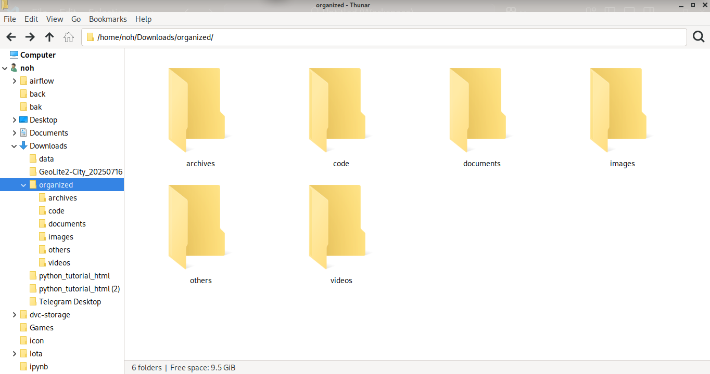

# File Organizer — Python Mini Project

A simple Python automation tool that organizes files into category folders based on their extensions. The script uses a YAML configuration file, supports dry-run mode, and can handle duplicates safely.

## Features
- Config-driven category mapping (YAML)
- Optional dry-run mode
- Duplicate handling (rename or skip)
- Clear console logging

## How It Works
The script reads rules from `config.yaml`, scans the source directory, and moves files into category folders under the destination directory. Unmatched extensions can be routed to an "Other" folder.

## Setup
1. Install Python 3.
2. Install dependencies:
   ```bash
   pip install pyyaml
   ```
3. Open `config.yaml` and set:
   - `source_dir`
        - example: "/home/noh/Downloads/
   - `destination_dir` 
        - example: "/home/noh/Downloads/organized/
   - Category/extension mappings

## Running the Script
Run normally:
```bash
python3 organizer.py
```
Run in dry-run mode:
```bash
python3 organizer.py --dry-run
```

## Example
Before:
```
Downloads/
    photo.jpg
    notes.txt
    script.py
```
After organizing:
```
Organized/
    Images/photo.jpg
    Documents/notes.txt
    Code/script.py
```

## Screenshot


## Future Enhancements
- Watchdog for real-time monitoring
- Scheduling for periodic cleanup
- Interactive CLI menu
- Unit tests